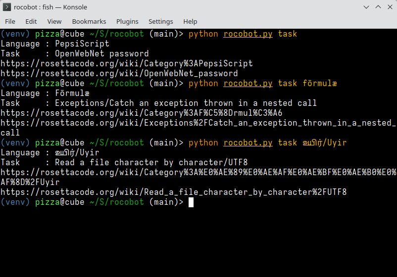

# rocobot

Picks out random uncompleted tasks from [RosettaCode](https://rosettacode.org) for you to complete.

## Usage

Print a random language:

    rocobot lang

Print out a random uncompleted task:

    rocobot task
    rocobot task C++

Print out a language that a specific task hasn't been implemented in:

    rocobot lang --doesnt-have FizzBuzz
